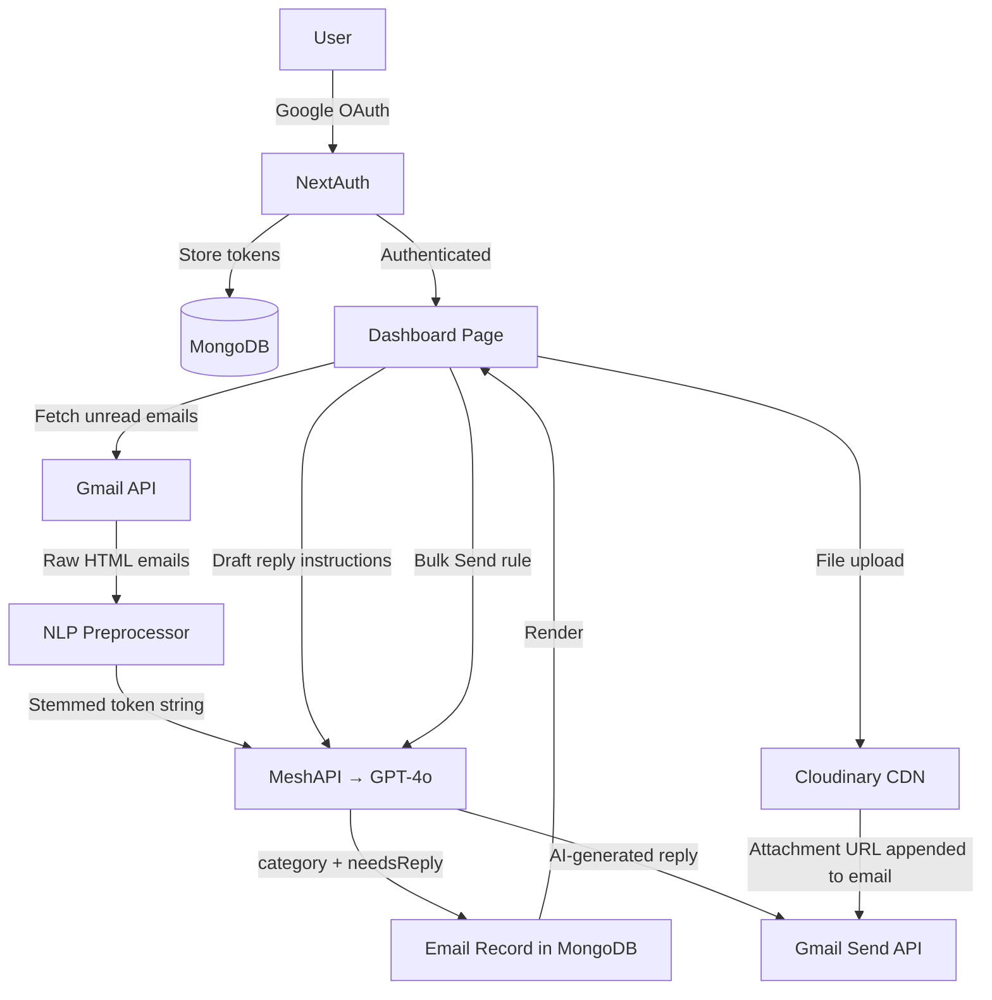

# SortMail

> **Autonomous AI inbox triage for Gmail — built with Next.js 16, GPT-4o via MeshAPI, and MongoDB.**

SortMail connects to your Gmail account and automatically classifies every unread email using an LLM. Instead of manually sorting through promotional noise, you see only what matters — categorized, prioritized, and ready to act on. You can also draft and send AI-generated replies, and configure per-category automation rules that fire against entire batches of emails at once.

---

## Overview

**Problem:** Gmail inboxes fill with newsletters, internship emails, finance alerts, and social notifications — all mixed together. Finding what actually needs a response is slow and mentally draining.

**Solution:** SortMail fetches your unread emails, compresses the content using NLP (stopword removal + Porter Stemming), and sends the optimized text to GPT-4o through MeshAPI. The model returns a category and a `needsReply` flag. The results are stored in MongoDB and surfaced through a clean, fast dashboard.

---

## What It Can Actually Do

- Sign in with Google OAuth and grant Gmail read/send permissions
- Fetch up to 15 unread emails per page from Gmail API
- Pre-process email HTML into compressed, stemmed tokens before sending to the LLM (reducing token cost)
- Classify each email into a category and flag whether it needs a reply
- Display emails in a filterable three-panel dashboard (Inbox / Needs Action / Read Later)
- Open an email and draft a contextual AI reply using natural language instructions
- Send that reply back through Gmail API directly from the app
- Configure per-category Auto-Handler rules with instructions, target senders, and optional file attachments (uploaded via Cloudinary)
- Execute a Bulk Send that either replies contextually to all flagged emails in a category, or broadcasts a generated email to a specific list of addresses
- View bulk send history (last 20 operations)
- Auto-refresh the dashboard every 15 seconds

---

## AI Email Categories

The LLM classifies each email into exactly one of:

| Category | Description |
|---|---|
| `internship` | Recruiter outreach, application updates, interview invites |
| `youtube` | YouTube notifications, creator updates |
| `newsletter` | Bulk newsletters and digest emails |
| `personal` | Emails from real people, friends, family |
| `social` | Social platform notifications |
| `finance` | Bank alerts, payment receipts, invoices |
| `security` | 2FA codes, login alerts, password resets |
| `other` | Everything else |

Newsletters are detected first via the `List-Unsubscribe` header, skipping the LLM call entirely for cost savings.

Each email also receives a boolean `needsReply` flag indicating whether immediate action is required.

---

## Architecture



---

## Tech Stack

| Layer | Technology |
|---|---|
| Framework | Next.js 16 (App Router), TypeScript |
| Styling | Tailwind CSS v4 |
| Animation | Framer Motion |
| Auth | NextAuth v4 with Google OAuth 2.0 |
| Database | MongoDB via Mongoose |
| AI / LLM | GPT-4o through MeshAPI (`api.meshapi.ai`) |
| Gmail | Google APIs Node.js client (`googleapis`) |
| NLP | `natural` (Porter Stemmer), `stopword`, `html-to-text` |
| File Storage | Cloudinary |
| Notifications | react-hot-toast |
| Icons | lucide-react |

---

## Project Structure

```
sortmail/
├── src/
│   ├── app/
│   │   ├── page.tsx              # Landing page with features, comparison, FAQ
│   │   ├── layout.tsx            # Root layout with metadata and Toaster
│   │   ├── globals.css
│   │   ├── auth/
│   │   │   └── signin/page.tsx   # Custom Google sign-in page
│   │   ├── dashboard/
│   │   │   └── page.tsx          # Server component — fetches emails, renders dashboard
│   │   └── api/
│   │       ├── auth/[...nextauth]/route.ts   # NextAuth handler + user upsert
│   │       ├── send/route.ts                 # Send a single reply via Gmail
│   │       ├── bulk-send/route.ts            # AI bulk reply or broadcast send
│   │       ├── bulk-history/route.ts         # Fetch last 20 bulk send records
│   │       ├── autorules/route.ts            # CRUD for per-category automation rules
│   │       ├── upload/route.ts               # Upload file attachment to Cloudinary
│   │       └── webhooks/gmail/route.ts       # Gmail Pub/Sub webhook receiver (stub)
│   ├── components/
│   │   ├── DashboardView.tsx     # Full dashboard UI — inbox, reply, auto-handler
│   │   └── LoginButton.tsx       # Google sign-in button
│   ├── lib/
│   │   ├── gmail.ts              # Fetch emails from Gmail, classify, persist
│   │   ├── llm.ts                # classifyEmail, generateContextualReply, generateBroadcastEmail
│   │   ├── mongodb.ts            # Cached Mongoose connection
│   │   └── nlp.ts                # HTML → plain text → stopword removal → stemming
│   └── models/
│       ├── User.ts               # googleId, email, accessToken, refreshToken
│       ├── Email.ts              # messageId, category, needsReply, htmlBody, snippet
│       ├── AutoRule.ts           # per-category automation rule config
│       └── BulkHistory.ts        # record of each bulk send operation
├── public/
│   └── manifest.json             # PWA manifest
├── .env.example
├── package.json
├── next.config.ts
└── tsconfig.json
```

---

## Prerequisites

- Node.js 18+
- A MongoDB Atlas cluster (or local MongoDB)
- A Google Cloud project with the Gmail API and OAuth 2.0 credentials enabled
- A MeshAPI account and API key ([meshapi.ai](https://meshapi.ai))
- A Cloudinary account (free tier works)

---

## Installation

```bash
# Clone the repository
git clone https://github.com/abhijit1859/SortMail.git
cd SortMail

# Install dependencies
npm install

# Copy the environment template
cp .env.example .env.local
```

---

## Environment Variables

Open `.env.local` and fill in the values:

```env
# MongoDB
MONGODB_URI=mongodb+srv://<user>:<password>@cluster.mongodb.net/sortmail

# Google OAuth (from Google Cloud Console)
GOOGLE_CLIENT_ID=your-google-client-id
GOOGLE_CLIENT_SECRET=your-google-client-secret

# NextAuth
NEXTAUTH_SECRET=a-long-random-secret-string
NEXTAUTH_URL=http://localhost:3000

# MeshAPI (used to route to GPT-4o)
MESH_API_KEY=your-mesh-api-key

# Cloudinary (for attachment uploads)
CLOUDINARY_CLOUD_NAME=your-cloud-name
CLOUDINARY_API_KEY=your-cloudinary-api-key
CLOUDINARY_API_SECRET=your-cloudinary-api-secret
```

| Variable | Description |
|---|---|
| `MONGODB_URI` | Full MongoDB connection string |
| `GOOGLE_CLIENT_ID` | OAuth 2.0 Client ID from Google Cloud Console |
| `GOOGLE_CLIENT_SECRET` | OAuth 2.0 Client Secret |
| `NEXTAUTH_SECRET` | Random secret for session encryption |
| `NEXTAUTH_URL` | Full URL where the app is running |
| `MESH_API_KEY` | MeshAPI key for routing to GPT-4o |
| `CLOUDINARY_CLOUD_NAME` | Cloudinary cloud name |
| `CLOUDINARY_API_KEY` | Cloudinary API key |
| `CLOUDINARY_API_SECRET` | Cloudinary API secret |

### Google OAuth Setup

1. Go to [Google Cloud Console](https://console.cloud.google.com/) → APIs & Services → Credentials
2. Create an OAuth 2.0 Client ID (Web Application)
3. Add authorized redirect URI: `http://localhost:3000/api/auth/callback/google`
4. Enable the **Gmail API** in your project

---

## Running Locally

```bash
npm run dev
```

Open [http://localhost:3000](http://localhost:3000).

Click **Login with Google**, grant Gmail permissions, and you will be redirected to your dashboard where email fetching and classification begins automatically.

---

## How It Works — Complete Flow

```
1. User signs in with Google OAuth
        ↓
2. NextAuth stores access_token + refresh_token in MongoDB (User document)
        ↓
3. Dashboard page (server component) calls fetchRecentEmails()
        ↓
4. Gmail API fetches up to 15 unread messages
        ↓
5. Each new message is checked against MongoDB (deduplication by messageId)
        ↓
6. For new emails:
   a. Extract HTML body from MIME payload
   b. Check List-Unsubscribe header → if present, skip LLM, classify as newsletter
   c. Run NLP: HTML → plain text → lowercase → tokenize → remove stopwords → stem (Porter)
   d. Send compressed snippet (max 500 chars) to GPT-4o via MeshAPI
   e. Parse JSON response: { category, needsReply }
   f. Save Email document to MongoDB
        ↓
7. Dashboard renders email list, filterable by category, needs action, or read later
        ↓
8. User can:
   - Read full email HTML in a detail panel
   - Draft a contextual AI reply with natural language instructions
   - Send the reply through Gmail API
   - Configure Auto-Handler rules per category
   - Execute bulk sends (AI contextual replies to all flagged emails, or broadcast to specific addresses)
```

---

## API Endpoints

| Method | Endpoint | Description |
|---|---|---|
| `GET` | `/api/auth/[...nextauth]` | NextAuth OAuth flow |
| `POST` | `/api/send` | Send a single reply via Gmail |
| `POST` | `/api/bulk-send` | AI bulk reply or broadcast send |
| `GET` | `/api/bulk-history` | Last 20 bulk send records |
| `GET/POST` | `/api/autorules` | Fetch or save a per-category automation rule |
| `POST` | `/api/upload` | Upload a file to Cloudinary, returns URL |
| `POST` | `/api/webhooks/gmail` | Gmail Pub/Sub push endpoint (parses message, stub) |

---

## Limitations

- Only unread emails are fetched (15 per page); there is no full inbox sync
- Email bodies are stored in MongoDB (`htmlBody` field); they are not processed statelessly despite the landing page copy claiming otherwise
- The Gmail Pub/Sub webhook (`/api/webhooks/gmail`) receives and parses push notifications but does not yet trigger a re-fetch or real-time classification
- No search functionality within the dashboard
- Single Gmail account per user session
- No test suite

---

## Future Improvements

- Real-time inbox sync via Gmail Pub/Sub (webhook processing is partially scaffolded)
- Natural language inbox search
- Per-user custom categories
- Multi-account Gmail support
- Inbox analytics dashboard
- Email summary generation
- Calendar event detection and extraction
- Background sync without page refresh

---

## Contributing

```bash
# Fork the repository, then:
git checkout -b feature/your-feature
git commit -m "feat: describe your change"
git push origin feature/your-feature
# Open a pull request against main
```

Please keep PRs focused. Do not change application logic and documentation in the same PR.

---

## Author

**Harsh Kharwar** — Project: SortMail · WK02 – Inbox Triage

---

## License

MIT License
